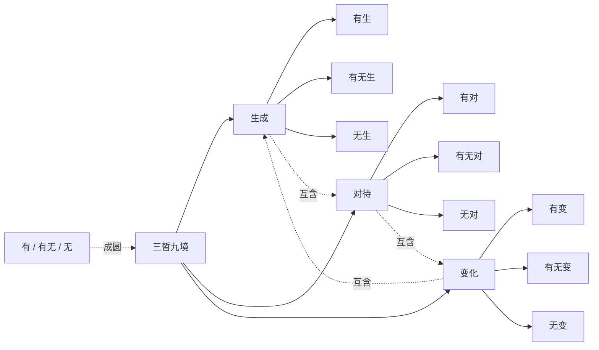

# 三晳九境

## 一句点题

三晳九境不是九个固定名词，而是一种训练看问题的方式：从生成、对待、变化三路进入，把有、有无、无看成一个能回环的整体。

## 九境总表

| 三晳 | 有 | 有无 | 无 | 白话抓手 |
| --- | --- | --- | --- | --- |
| 生成 | 有生 | 有无生 | 无生 | 这件事怎样出现、成形，又怎样回到更深的根据。 |
| 对待 | 有对 | 有无对 | 无对 | 关系、分别、标准怎样成立，又怎样不被对立困住。 |
| 变化 | 有变 | 有无变 | 无变 | 流转和转化怎样发生，变中有什么不被带走。 |

## 白话说明

入门时，先把三晳当成三个问题：

- 生成：这件事从哪里来，靠什么条件成立？
- 对待：它和什么相对、相依、相互界定？
- 变化：它在什么条件下转化，哪些地方变，哪些地方不变？

九境就是把这三个问题各自再推一层：不只看显出来的有，也看半显半隐的有无，还要追到不被表面现象限定的无。这里的“无”不是否定一切，而是防止自己只卡在现象上。

更关键的是互义：生成里有对待和变化，对待里有生成和变化，变化里有生成和对待。所以三晳不是三个工具的并列清单，而是一个互相牵引、互相成全的整体。

## 一张图

## 学习路径

1. 先记住三条主线：生成、对待、变化。
2. 再把每条主线展开为三境：有、有无、无。
3. 用一个具体对象练习，比如一段关系、一个项目、一个念头。
4. 先问它如何生成，再问它如何对待，最后问它如何变化。
5. 回头检查：你是否把三者割裂了？能否在生成中看到对待和变化？
6. 最后把九境收回一个整体：不是为了分类，而是为了转变观察方式。

## 常见误区

| 误区 | 更稳妥的理解 |
| --- | --- |
| 把九境当成九个固定等级 | 九境是观察结构，不是僵硬阶梯。 |
| 把无生、无对、无变理解成否定一切 | 无不是抹掉现象，而是追到更深的根据。 |
| 把三晳当成贴标签工具 | 可以从工具入门，但目标是改变看事物的方式。 |
| 只承认一种叫法 | 化生、生成、流行、变化等口径有层次差异，不必互相否定。 |
| 把有、有无、无讲成单向路线 | 三者应回环理解，不是越往后越高级。 |

## 自问自答练习

自问：我观察一件事时，只看到了“它发生了”，还缺什么？

自答：还要看它凭什么发生、与什么相待、会怎样变化。

自问：我说“无对”，是不是等于没有任何分别？

自答：不是。它不是取消分别，而是不被分别困住，还能说明分别如何成立。

自问：为什么三晳不能拆成三个孤立概念？

自答：因为生成、对待、变化彼此互含。只讲其中一个，若带不出另外两个，就还没有进入三晳的整体。

## 少量来源锚点

| 来源 | 短摘句 |
| --- | --- |
| 《07太极思维》 | “生成规律——有生、有无生、无生” |
| 《07太极思维》 | “一个晳是一个圈，两个晳也是一个圈” |
| 《55讲义第二》 | “三晳本义、三晳互义，这是三晳的灵魂” |
| 《12前后三晳》 | “概念不完全一样，但它们是一脉相承的” |
| 《33三晳讲论》 | “三晳互含，一三三一” |
| 《36三晳讲义》 | “并行同在的，并没有先后高下之别” |

## 延伸阅读

- [概念总图](../learning/concept-map.md)
- [核心术语表](../terms/glossary.md)
- [学习路径](../learning/path.md)
- [资料总览](../sources/index.md)
