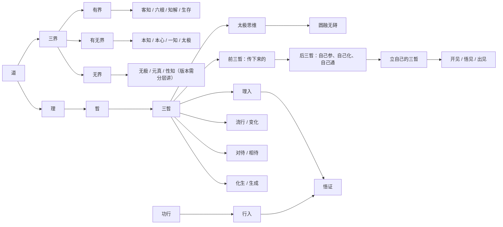

# 三晳知识图谱与教学主线

## 一句话总纲

- 道下为理，理上为晳。
- 三界给出层次框架，三晳给出公开可讲的活法。
- 理入与行入是一体两用，最终都归到悟证。
- 前三晳是传下来的，后三晳是你自己要立起来的。

## 一张总图

## 关系说明

### 1. 道、理、晳

- `01三晳九问.docx` 明讲“道下为理，理上为晳”。
- 所以后续教学里，凡讲三晳，不是把它当孤立术语，而是把它放在“道 → 理 → 晳”的序列里看。

### 2. 三界与一知三界

- 常用口径：三界是“无界、有无界、有界”。
- 一知三界口径：`02一知三界.pdf` 与 `08客知本知.docx` 更偏重从“知”的分层看三界。
- 教学原则：用户问哲理地图时，用“三界框架”；问客知、本知、性知时，再切到“一知三界”。

### 3. 三晳与显三晳

- 显三晳是有界公开可讲的核心基础。
- 名相上有“化生/对待/流行”“生成/对待/变化”“生/对/变”三组常见讲法。
- 教学原则：先讲它们是同一路活法的不同表达，再讲名称为什么会调整。

### 4. 理入与行入

- `附1理入行入.docx` 给出的抓手最稳：理入修心神，行入炼形气。
- 两者不是二选一，更不是互相否定，而是“一体两用”的两条门径。
- 课堂上若用户只问功行，不强行扯大哲理；若只问理路，也要提醒不能把理行说成空话。

### 5. 前三晳与后三晳

- 前三晳是老师和资料能讲给你的那部分。
- 后三晳是你必须自己建立、自己打通、自己消化的那部分。
- 所以后续教学中，凡用户只想“拿现成答案”，都要提醒：你拿到的是前三晳材料，不等于你已经有后三晳。

## 教学主线

### A. 入门总纲

- 先讲为什么学三晳、三晳解决什么问题。
- 主资料：`01三晳九问.docx`、`43基础知识.docx`、`10太极常识.docx`。

### B. 三晳结构

- 讲三晳到底如何成一个整体，以及为什么不能死背名相。
- 主资料：`04五阶七无.docx`、`06三晳互义.docx`、`11一体两应.docx`、`12前后三晳.docx`。

### C. 三界与心性

- 讲客知、本知、性知，讲心、性、灵如何安放。
- 主资料：`02一知三界.pdf`、`08客知本知.docx`、`16心本无象.docx`、`18道通三界.docx`。

### D. 理入与修证

- 讲理入、行入、悟、证、误区、印证。
- 主资料：`09问道证道.docx`、`20周行不殆.docx`、`28忘心入道.docx`、`40意根入道.docx`、`45涤除玄览.docx`。

### E. 答疑与破执

- 讲常见卡点：没感觉、听不懂、著境界、拿旧话硬套。
- 主资料：`20同学来信.docx`、`21没感觉了.docx`、`47分享智慧.docx`、`50知者不问.docx`。

### F. 总讲串联

- 用户一旦问“大地图”，优先从总讲义回收全局。
- 主资料：`33三晳讲论.pdf`、`36三晳讲义.docx`、`36三晳讲义.pdf`、`41台版谈道.docx`、`55讲义第二.docx`。

## 版本裁决规则

- 老师直讲 > 老师署名整理 > 系统讲义 > 同门讨论 > 附录补充。
- 旧口径与新口径并存时，先讲当前通用口径，再补“这是早期/后期的不同铺排”。
- 哲理讲法与实证讲法冲突时，不裁成一刀切，而是明确说明“层次不同，不能混讲”。
