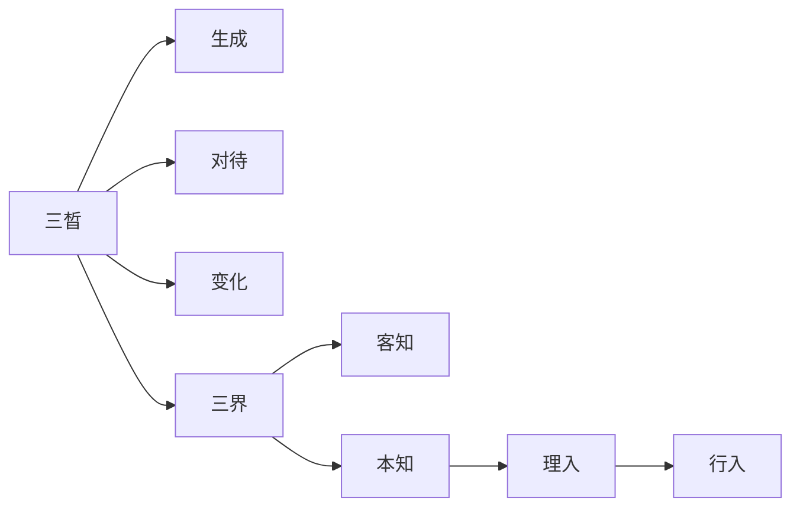

# Concept Map

## Summary

本图把概念从三晳总览展开到三界、知、理入行入和误读审查。

```mermaid
flowchart LR
  A[三晳] --> B[生成]
  A --> C[对待]
  A --> D[变化]
  A --> E[三界]
  E --> F[客知]
  E --> G[本知]
  G --> H[理入]
  H --> I[行入]
```
