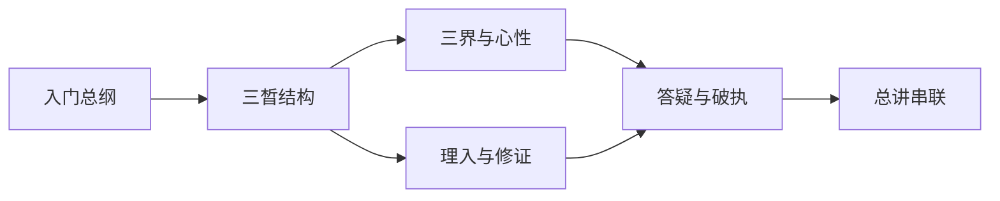

# 依赖图

## Summary

学习上先建立总图，再进入三晳结构、三界心性、理入行入与答疑破执。

| 模块 | 资料数 |
| --- | --- |
| 模块 A：入门总纲 | 3 |
| 模块 B：三晳结构 | 4 |
| 模块 C：三界与心性 | 4 |
| 模块 D：理入与修证 | 5 |
| 模块 E：答疑与破执 | 4 |
| 模块 F：总讲与通盘串联 | 5 |
| 待归类 | 41 |

