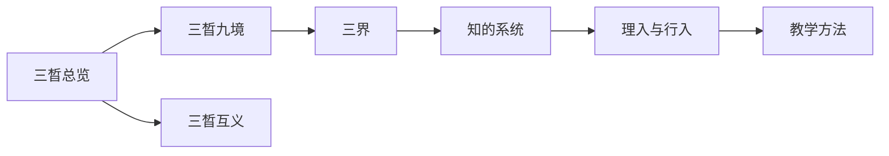

# Dependency Map

## Summary

先入三晳总览，再看三晳九境、互义、三界和知的系统，最后落到理入行入与教学练习。

```mermaid
flowchart LR
  A[三晳总览] --> B[三晳九境]
  A --> C[三晳互义]
  B --> D[三界]
  D --> E[知的系统]
  E --> F[理入与行入]
  F --> G[教学方法]
```
