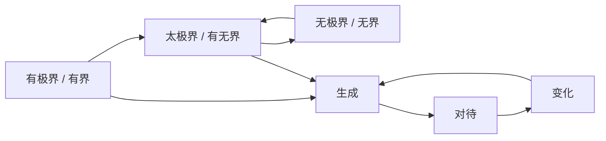

# Root Doctrine

## Summary

根本图不是知识树，而是三晳思维的走法：从有极界可说之理入手，经太极界有无圆转，知其不可用旧知占有无极界。

## HERSs

- Hypothesis: 先立原文命脉假设。
- Evidence: 用短摘句校验。
- Rewrite: 按生、对、变重写。
- Score: 以 v3 lint 查模板化和缺项。
- Stabilize: 主 agent 合并入 canonical wiki。
