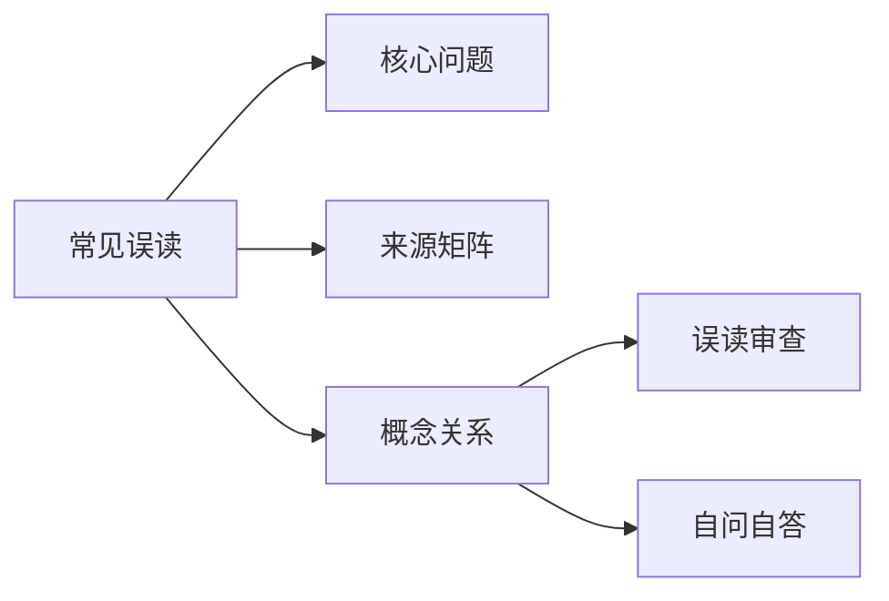

# 常见误读

## Summary

常见误读集中在把概念说死、把无理解成否定、把学习当作收集名词。

## Why This Matters

没有误读清单，Wiki 会越讲越像术语表，反而强化执见。

## Core Structure

- 先抓主题问题：常见误读集中在把概念说死、把无理解成否定、把学习当作收集名词。
- 再回到来源矩阵，区分主干证据和辅助证据。
- 最后用误读审查防止把概念讲死。

## Source Matrix

| 资料 | 层级 | 模块 |
| --- | --- | --- |
| [01三晳九问](../sources/001-01.md) | 二级基础框架资料 | 模块 A：入门总纲 |
| [03一念落五](../sources/003-03.md) | 未分级资料 | 待归类 |
| [07太极思维](../sources/007-07.md) | 未分级资料 | 待归类 |
| [09问道证道](../sources/009-09.md) | 三级专题深化资料 | 模块 D：理入与修证 |
| [13我是杯子](../sources/013-13.md) | 未分级资料 | 待归类 |
| [18道通三界](../sources/018-18.md) | 三级专题深化资料 | 模块 C：三界与心性 |
| [20同学来信](../sources/020-20.md) | 四级问答案例资料 | 模块 E：答疑与破执 |
| [20周行不殆](../sources/021-20.md) | 未分级资料 | 模块 D：理入与修证 |
| [21没感觉了](../sources/022-21.md) | 四级问答案例资料 | 模块 E：答疑与破执 |
| [26相信自己](../sources/027-26.md) | 未分级资料 | 待归类 |

## Key Claims

- 01三晳九问：三晳格解当来，格解当来之时就是什么
- 03一念落五：这是一条由有为渐渐地归入无为的途径
- 07太极思维：《太极经》是我们的法本
- 09问道证道：证者回身笑曰:求证者如是!
- 13我是杯子：文：说我不是杯子也可以帮助你参悟啊
- 18道通三界：三晳是可以对自己动刀的哲学

## Concept Graph

## Misreadings

- 把一个教学口径说成唯一绝对口径。
- 把概念表当成境界本身。
- 只摘句不回到整体结构。

## Self-QA Lesson

自问：这个专题先解决什么问题？

自答：先用一句白话抓住主轴，再回到来源矩阵检查证据，最后反问自己有没有把话说死。

## Related Pages

- 三晳总览

## Evidence Anchors

| 来源 | 定位 | 短摘句 |
| --- | --- | --- |
| 01三晳九问 | theme_excerpt[1] | “三晳格解当来，格解当来之时就是什么” |
| 03一念落五 | theme_excerpt[1] | “这是一条由有为渐渐地归入无为的途径” |
| 07太极思维 | theme_excerpt[1] | “《太极经》是我们的法本” |
| 09问道证道 | theme_excerpt[1] | “证者回身笑曰:求证者如是!” |
| 13我是杯子 | theme_excerpt[1] | “文：说我不是杯子也可以帮助你参悟啊” |
| 18道通三界 | theme_excerpt[1] | “三晳是可以对自己动刀的哲学” |
