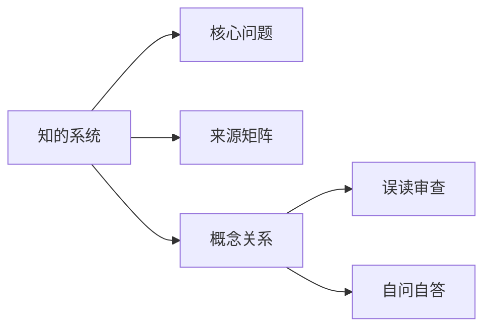

# 知的系统

## Summary

客知、本知、性知分别指向知解、觉悟与更根本的生命之知。

## Why This Matters

用户最容易把本知讲成高级聪明，必须通过层次拆开。

## Core Structure

- 先抓主题问题：客知、本知、性知分别指向知解、觉悟与更根本的生命之知。
- 再回到来源矩阵，区分主干证据和辅助证据。
- 最后用误读审查防止把概念讲死。

## Source Matrix

| 资料 | 层级 | 模块 |
| --- | --- | --- |
| [36三晳讲义](../sources/038-36.md) | 一级主干资料 | 模块 F：总讲与通盘串联 |
| [02一知三界](../sources/002-02.md) | 未分级资料 | 模块 C：三界与心性 |
| [08客知本知](../sources/008-08.md) | 三级专题深化资料 | 模块 C：三界与心性 |
| [18道通三界](../sources/018-18.md) | 三级专题深化资料 | 模块 C：三界与心性 |
| [附5客知本知](../sources/062-appendix-5.md) | 五级附录资料 | 待归类 |
| [07太极思维](../sources/007-07.md) | 未分级资料 | 待归类 |
| [附9性慧心明](../sources/066-appendix-9.md) | 未分级资料 | 待归类 |
| [33三晳讲论](../sources/034-33.md) | 一级主干资料 | 模块 F：总讲与通盘串联 |
| [41台版谈道](../sources/043-41.md) | 一级主干资料 | 模块 F：总讲与通盘串联 |
| [55讲义第二](../sources/057-55.md) | 一级主干资料 | 模块 F：总讲与通盘串联 |

## Key Claims

- 36三晳讲义：[第87页] 86 罪过吗？显然不能这样算。因为若是有罪，最大的祸首应该是自然。 （六根未生之前的境界能推吗？六根不用的境界有知吗？）六根之外属于知悟界定
- 02一知三界：[第1页] 1 一知与三界 生：先生以“知”为人的大欲，那知与心性神灵；知与识欲感 觉，是什么关系？它们之间是怎样协调组合的？ 师：形用有形，故有定格；神用无象，故无定式。为便有界人 见，…
- 08客知本知：慧知的意思也是悟知之意
- 18道通三界：三晳是可以对自己动刀的哲学
- 附5客知本知：慧知的意思也是悟知之意
- 07太极思维：《太极经》是我们的法本

## Concept Graph

## Misreadings

- 把一个教学口径说成唯一绝对口径。
- 把概念表当成境界本身。
- 只摘句不回到整体结构。

## Self-QA Lesson

自问：这个专题先解决什么问题？

自答：先用一句白话抓住主轴，再回到来源矩阵检查证据，最后反问自己有没有把话说死。

## Related Pages

- 三晳总览

## Evidence Anchors

| 来源 | 定位 | 短摘句 |
| --- | --- | --- |
| 36三晳讲义 | theme_excerpt[1] | “[第87页] 86 罪过吗？显然不能这样算。因为若是有罪，最大的祸首应该是自然…” |
| 02一知三界 | theme_excerpt[1] | “[第1页] 1 一知与三界 生：先生以“知”为人的大欲，那知与心性神灵；知与识…” |
| 08客知本知 | theme_excerpt[1] | “慧知的意思也是悟知之意” |
| 18道通三界 | theme_excerpt[1] | “三晳是可以对自己动刀的哲学” |
| 附5客知本知 | theme_excerpt[1] | “慧知的意思也是悟知之意” |
| 07太极思维 | theme_excerpt[1] | “《太极经》是我们的法本” |
