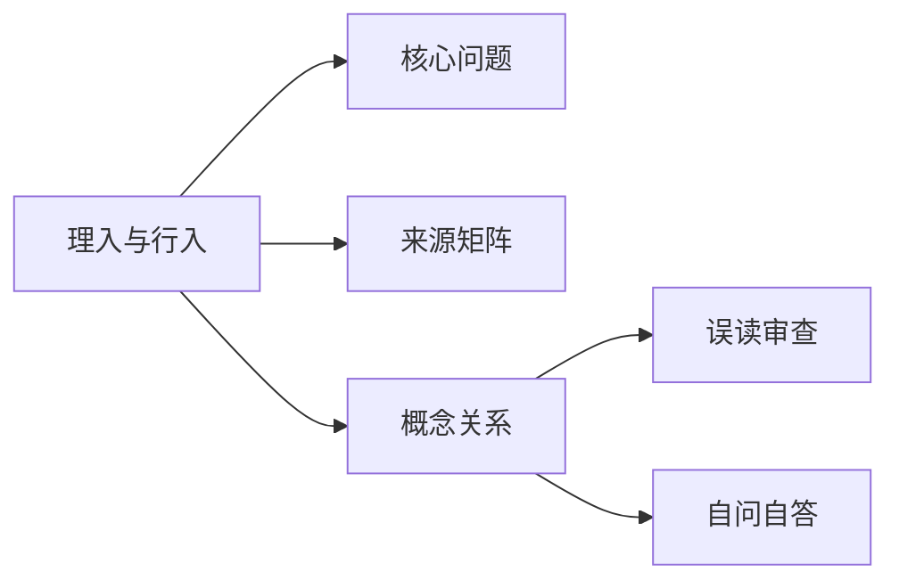

# 理入与行入

## Summary

理入偏理路参悟，行入偏功行实践，二者是一体两用。

## Why This Matters

它决定学习三晳不能只停在概念，也不能只谈功法而不明理。

## Core Structure

- 先抓主题问题：理入偏理路参悟，行入偏功行实践，二者是一体两用。
- 再回到来源矩阵，区分主干证据和辅助证据。
- 最后用误读审查防止把概念讲死。

## Source Matrix

| 资料 | 层级 | 模块 |
| --- | --- | --- |
| [30三灵无上](../sources/031-30.md) | 三级专题深化资料 | 待归类 |
| [附1理入行入](../sources/058-appendix-1.md) | 五级附录资料 | 待归类 |
| [09问道证道](../sources/009-09.md) | 三级专题深化资料 | 模块 D：理入与修证 |
| [28忘心入道](../sources/029-28.md) | 三级专题深化资料 | 模块 D：理入与修证 |
| [45涤除玄览](../sources/047-45.md) | 未分级资料 | 模块 D：理入与修证 |
| [36三晳讲义](../sources/038-36.md) | 一级主干资料 | 模块 F：总讲与通盘串联 |
| [20周行不殆](../sources/021-20.md) | 未分级资料 | 模块 D：理入与修证 |
| [40意根入道](../sources/042-40.md) | 未分级资料 | 模块 D：理入与修证 |
| [41台版谈道](../sources/043-41.md) | 一级主干资料 | 模块 F：总讲与通盘串联 |
| [55讲义第二](../sources/057-55.md) | 一级主干资料 | 模块 F：总讲与通盘串联 |

## Key Claims

- 30三灵无上：修，即行入；悟，即理入
- 附1理入行入：因此从根本上来说，三晳是可以自学的
- 09问道证道：证者回身笑曰:求证者如是!
- 28忘心入道：以无自性故， 他性亦复无
- 45涤除玄览：当然也可以说是“本性”
- 36三晳讲义：[第87页] 86 罪过吗？显然不能这样算。因为若是有罪，最大的祸首应该是自然。 （六根未生之前的境界能推吗？六根不用的境界有知吗？）六根之外属于知悟界定

## Concept Graph

## Misreadings

- 把一个教学口径说成唯一绝对口径。
- 把概念表当成境界本身。
- 只摘句不回到整体结构。

## Self-QA Lesson

自问：这个专题先解决什么问题？

自答：先用一句白话抓住主轴，再回到来源矩阵检查证据，最后反问自己有没有把话说死。

## Related Pages

- 三晳总览

## Evidence Anchors

| 来源 | 定位 | 短摘句 |
| --- | --- | --- |
| 30三灵无上 | theme_excerpt[1] | “修，即行入；悟，即理入” |
| 附1理入行入 | theme_excerpt[1] | “因此从根本上来说，三晳是可以自学的” |
| 09问道证道 | theme_excerpt[1] | “证者回身笑曰:求证者如是!” |
| 28忘心入道 | theme_excerpt[1] | “以无自性故， 他性亦复无” |
| 45涤除玄览 | theme_excerpt[1] | “当然也可以说是“本性”” |
| 36三晳讲义 | theme_excerpt[1] | “[第87页] 86 罪过吗？显然不能这样算。因为若是有罪，最大的祸首应该是自然…” |
