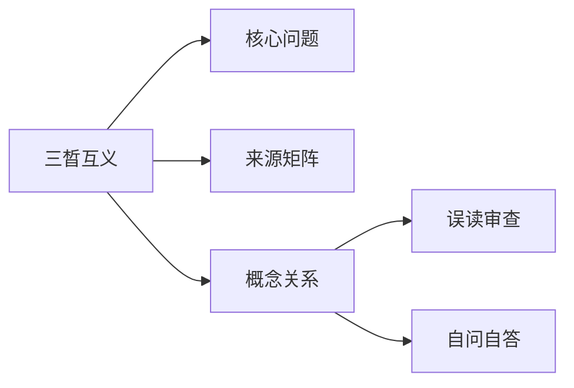

# 三晳互义

## Summary

互义说明每一晳都含另外两晳，使三晳不散成三个孤立概念。

## Why This Matters

这是三晳从表格变成活法的关键。

## Core Structure

- 先抓主题问题：互义说明每一晳都含另外两晳，使三晳不散成三个孤立概念。
- 再回到来源矩阵，区分主干证据和辅助证据。
- 最后用误读审查防止把概念讲死。

## Source Matrix

| 资料 | 层级 | 模块 |
| --- | --- | --- |
| [06三晳互义](../sources/006-06.md) | 未分级资料 | 模块 B：三晳结构 |
| [55讲义第二](../sources/057-55.md) | 一级主干资料 | 模块 F：总讲与通盘串联 |
| [51物我一体](../sources/053-51.md) | 未分级资料 | 待归类 |
| [04五阶七无](../sources/004-04.md) | 二级基础框架资料 | 模块 B：三晳结构 |
| [11一体两应](../sources/011-11.md) | 未分级资料 | 模块 B：三晳结构 |
| [12前后三晳](../sources/012-12.md) | 二级基础框架资料 | 模块 B：三晳结构 |
| [33三晳讲论](../sources/034-33.md) | 一级主干资料 | 模块 F：总讲与通盘串联 |
| [36三晳讲义](../sources/037-36.md) | 一级主干资料 | 模块 F：总讲与通盘串联 |
| [36三晳讲义](../sources/038-36.md) | 一级主干资料 | 模块 F：总讲与通盘串联 |
| [41台版谈道](../sources/043-41.md) | 一级主干资料 | 模块 F：总讲与通盘串联 |

## Key Claims

- 06三晳互义：标准是世见，对待是哲观
- 55讲义第二：第一层：心是心，念是念
- 51物我一体：这是陆祖师讲的三晳互义
- 04五阶七无：就像上次三晳班，后面几天说话都自己提着自己的尾巴，免得给别人抓。为什么能进入这个境界呢？三晳打出来的，但这个还只是小循环，还没有到大循环。我说的这第四个，就是大循环
- 11一体两应：现在是要假装不知道三晳
- 12前后三晳：三晳是宇宙最强的表达方式

## Concept Graph

## Misreadings

- 把一个教学口径说成唯一绝对口径。
- 把概念表当成境界本身。
- 只摘句不回到整体结构。

## Self-QA Lesson

自问：这个专题先解决什么问题？

自答：先用一句白话抓住主轴，再回到来源矩阵检查证据，最后反问自己有没有把话说死。

## Related Pages

- 三晳总览

## Evidence Anchors

| 来源 | 定位 | 短摘句 |
| --- | --- | --- |
| 06三晳互义 | theme_excerpt[1] | “标准是世见，对待是哲观” |
| 55讲义第二 | theme_excerpt[1] | “第一层：心是心，念是念” |
| 51物我一体 | theme_excerpt[1] | “这是陆祖师讲的三晳互义” |
| 04五阶七无 | theme_excerpt[1] | “就像上次三晳班，后面几天说话都自己提着自己的尾巴，免得给别人抓。为什么能进入这…” |
| 11一体两应 | theme_excerpt[1] | “现在是要假装不知道三晳” |
| 12前后三晳 | theme_excerpt[1] | “三晳是宇宙最强的表达方式” |
