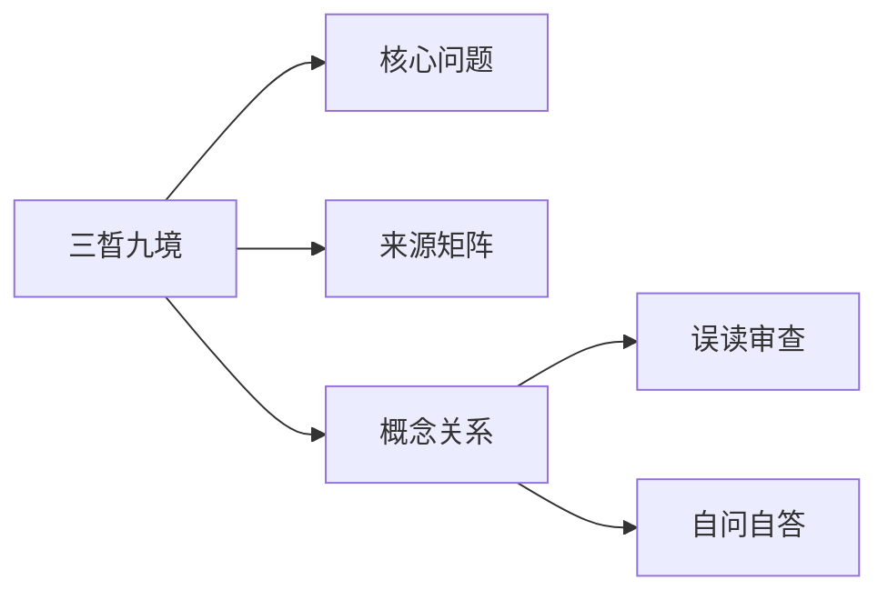

# 三晳九境

## Summary

三晳九境把生成、对待、变化分别沿有、有无、无展开，形成一个圆转观察结构。

## Why This Matters

它能防止只背生、对、变三个名词，也能防止把有、有无、无讲成单向台阶。

## Core Structure

- 先抓主题问题：三晳九境把生成、对待、变化分别沿有、有无、无展开，形成一个圆转观察结构。
- 再回到来源矩阵，区分主干证据和辅助证据。
- 最后用误读审查防止把概念讲死。

## Source Matrix

| 资料 | 层级 | 模块 |
| --- | --- | --- |
| [17本自具足](../sources/017-17.md) | 未分级资料 | 待归类 |
| [55讲义第二](../sources/057-55.md) | 一级主干资料 | 模块 F：总讲与通盘串联 |
| [14生命兼并](../sources/014-14.md) | 未分级资料 | 待归类 |
| [16心本无象](../sources/016-16.md) | 三级专题深化资料 | 模块 C：三界与心性 |
| [22我是上帝](../sources/023-22.md) | 未分级资料 | 待归类 |
| [23偶然必然](../sources/024-23.md) | 未分级资料 | 待归类 |
| [45涤除玄览](../sources/047-45.md) | 未分级资料 | 模块 D：理入与修证 |
| [54知乎太极](../sources/056-54.md) | 未分级资料 | 待归类 |
| [33三晳讲论](../sources/034-33.md) | 一级主干资料 | 模块 F：总讲与通盘串联 |
| [36三晳讲义](../sources/037-36.md) | 一级主干资料 | 模块 F：总讲与通盘串联 |

## Key Claims

- 17本自具足：提示一下，太极立道三则是什么？
- 55讲义第二：第一层：心是心，念是念
- 14生命兼并：[第16页] 16 讲，没机会了。我就是再讲生命，也不一样了，也不是这个境界 了，…… 人的知解都是界定吸收。看到和听到什么，自己先进行界定。 如果你不能理解，那你就没办法吸收。 对于那个…
- 16心本无象：自己悟，那是随时的事情
- 22我是上帝：对待难道就只有是与不是这一对？
- 23偶然必然：统领对待的是.....？

## Concept Graph

## Misreadings

- 把一个教学口径说成唯一绝对口径。
- 把概念表当成境界本身。
- 只摘句不回到整体结构。

## Self-QA Lesson

自问：这个专题先解决什么问题？

自答：先用一句白话抓住主轴，再回到来源矩阵检查证据，最后反问自己有没有把话说死。

## Related Pages

- 三晳总览

## Evidence Anchors

| 来源 | 定位 | 短摘句 |
| --- | --- | --- |
| 17本自具足 | theme_excerpt[1] | “提示一下，太极立道三则是什么？” |
| 55讲义第二 | theme_excerpt[1] | “第一层：心是心，念是念” |
| 14生命兼并 | theme_excerpt[1] | “[第16页] 16 讲，没机会了。我就是再讲生命，也不一样了，也不是这个境界…” |
| 16心本无象 | theme_excerpt[1] | “自己悟，那是随时的事情” |
| 22我是上帝 | theme_excerpt[1] | “对待难道就只有是与不是这一对？” |
| 23偶然必然 | theme_excerpt[1] | “统领对待的是.....？” |
