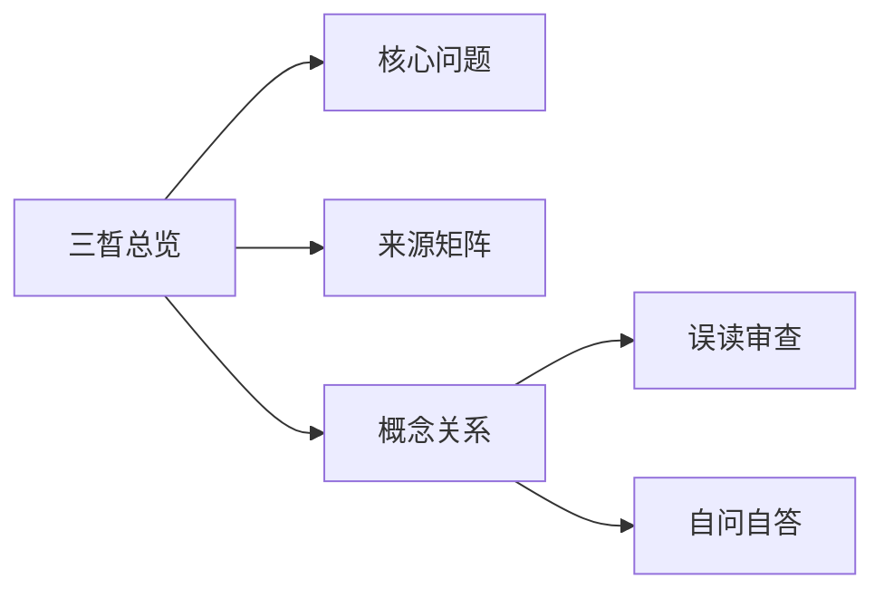

# 三晳总览

## Summary

三晳是把万有放回生成、对待、变化三路中观察，并借此转变思维的核心入口。

## Why This Matters

它是整套资料的公共入口；不先把三晳讲活，后面的三界、本知、理入都容易变成名词堆砌。

## Core Structure

- 先抓主题问题：三晳是把万有放回生成、对待、变化三路中观察，并借此转变思维的核心入口。
- 再回到来源矩阵，区分主干证据和辅助证据。
- 最后用误读审查防止把概念讲死。

## Source Matrix

| 资料 | 层级 | 模块 |
| --- | --- | --- |
| [04五阶七无](../sources/004-04.md) | 二级基础框架资料 | 模块 B：三晳结构 |
| [06三晳互义](../sources/006-06.md) | 未分级资料 | 模块 B：三晳结构 |
| [12前后三晳](../sources/012-12.md) | 二级基础框架资料 | 模块 B：三晳结构 |
| [33三晳讲论](../sources/034-33.md) | 一级主干资料 | 模块 F：总讲与通盘串联 |
| [36三晳讲义](../sources/038-36.md) | 一级主干资料 | 模块 F：总讲与通盘串联 |
| [01三晳九问](../sources/001-01.md) | 二级基础框架资料 | 模块 A：入门总纲 |
| [03一念落五](../sources/003-03.md) | 未分级资料 | 待归类 |
| [07太极思维](../sources/007-07.md) | 未分级资料 | 待归类 |
| [08客知本知](../sources/008-08.md) | 三级专题深化资料 | 模块 C：三界与心性 |
| [09问道证道](../sources/009-09.md) | 三级专题深化资料 | 模块 D：理入与修证 |

## Key Claims

- 04五阶七无：就像上次三晳班，后面几天说话都自己提着自己的尾巴，免得给别人抓。为什么能进入这个境界呢？三晳打出来的，但这个还只是小循环，还没有到大循环。我说的这第四个，就是大循环
- 06三晳互义：标准是世见，对待是哲观
- 12前后三晳：三晳是宇宙最强的表达方式
- 33三晳讲论：[第389页] 384 得实在奇突！ 所以现在我都任其自然，随缘随份，不再强求。 你们应该抓紧时间，多写文章，自树树人！ ·太极学者勠力同心为中华传统的复兴与再起而努力！ 传统文化会重新被…
- 36三晳讲义：[第87页] 86 罪过吗？显然不能这样算。因为若是有罪，最大的祸首应该是自然。 （六根未生之前的境界能推吗？六根不用的境界有知吗？）六根之外属于知悟界定
- 01三晳九问：三晳格解当来，格解当来之时就是什么

## Concept Graph

## Misreadings

- 把一个教学口径说成唯一绝对口径。
- 把概念表当成境界本身。
- 只摘句不回到整体结构。

## Self-QA Lesson

自问：这个专题先解决什么问题？

自答：先用一句白话抓住主轴，再回到来源矩阵检查证据，最后反问自己有没有把话说死。

## Related Pages

- 三晳总览

## Evidence Anchors

| 来源 | 定位 | 短摘句 |
| --- | --- | --- |
| 04五阶七无 | theme_excerpt[1] | “就像上次三晳班，后面几天说话都自己提着自己的尾巴，免得给别人抓。为什么能进入这…” |
| 06三晳互义 | theme_excerpt[1] | “标准是世见，对待是哲观” |
| 12前后三晳 | theme_excerpt[1] | “三晳是宇宙最强的表达方式” |
| 33三晳讲论 | theme_excerpt[1] | “[第389页] 384 得实在奇突！ 所以现在我都任其自然，随缘随份，不再强求…” |
| 36三晳讲义 | theme_excerpt[1] | “[第87页] 86 罪过吗？显然不能这样算。因为若是有罪，最大的祸首应该是自然…” |
| 01三晳九问 | theme_excerpt[1] | “三晳格解当来，格解当来之时就是什么” |
