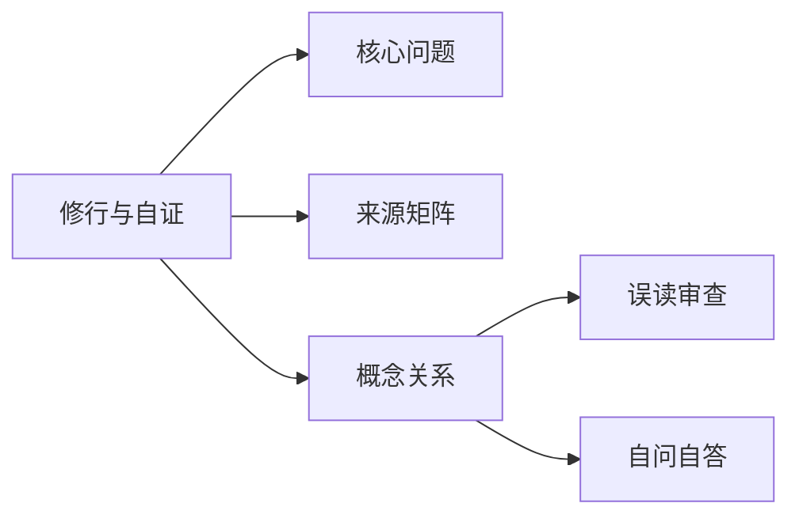

# 修行与自证

## Summary

修行与自证把理路落回心身实践，避免只在语言上转圈。

## Why This Matters

资料反复提示理入和行入不可截分，练习必须进入自身。

## Core Structure

- 先抓主题问题：修行与自证把理路落回心身实践，避免只在语言上转圈。
- 再回到来源矩阵，区分主干证据和辅助证据。
- 最后用误读审查防止把概念讲死。

## Source Matrix

| 资料 | 层级 | 模块 |
| --- | --- | --- |
| [22我是上帝](../sources/023-22.md) | 未分级资料 | 待归类 |
| [24道与自然](../sources/025-24.md) | 三级专题深化资料 | 待归类 |
| [30三灵无上](../sources/031-30.md) | 三级专题深化资料 | 待归类 |
| [39深度思考](../sources/041-39.md) | 未分级资料 | 待归类 |
| [48浅学深悟](../sources/050-48.md) | 四级问答案例资料 | 待归类 |
| [33三晳讲论](../sources/034-33.md) | 一级主干资料 | 模块 F：总讲与通盘串联 |
| [36三晳讲义](../sources/037-36.md) | 一级主干资料 | 模块 F：总讲与通盘串联 |
| [36三晳讲义](../sources/038-36.md) | 一级主干资料 | 模块 F：总讲与通盘串联 |
| [41台版谈道](../sources/043-41.md) | 一级主干资料 | 模块 F：总讲与通盘串联 |
| [55讲义第二](../sources/057-55.md) | 一级主干资料 | 模块 F：总讲与通盘串联 |

## Key Claims

- 22我是上帝：对待难道就只有是与不是这一对？
- 24道与自然：《太极经》中讲的是“有无浑成”
- 30三灵无上：修，即行入；悟，即理入
- 39深度思考：若（道）心有住，即为非住
- 48浅学深悟：流行和变化，还是有区别的
- 33三晳讲论：[第389页] 384 得实在奇突！ 所以现在我都任其自然，随缘随份，不再强求。 你们应该抓紧时间，多写文章，自树树人！ ·太极学者勠力同心为中华传统的复兴与再起而努力！ 传统文化会重新被…

## Concept Graph

## Misreadings

- 把一个教学口径说成唯一绝对口径。
- 把概念表当成境界本身。
- 只摘句不回到整体结构。

## Self-QA Lesson

自问：这个专题先解决什么问题？

自答：先用一句白话抓住主轴，再回到来源矩阵检查证据，最后反问自己有没有把话说死。

## Related Pages

- 问道与证道

## Evidence Anchors

| 来源 | 定位 | 短摘句 |
| --- | --- | --- |
| 22我是上帝 | theme_excerpt[1] | “对待难道就只有是与不是这一对？” |
| 24道与自然 | theme_excerpt[1] | “《太极经》中讲的是“有无浑成”” |
| 30三灵无上 | theme_excerpt[1] | “修，即行入；悟，即理入” |
| 39深度思考 | theme_excerpt[1] | “若（道）心有住，即为非住” |
| 48浅学深悟 | theme_excerpt[1] | “流行和变化，还是有区别的” |
| 33三晳讲论 | theme_excerpt[1] | “[第389页] 384 得实在奇突！ 所以现在我都任其自然，随缘随份，不再强求…” |
