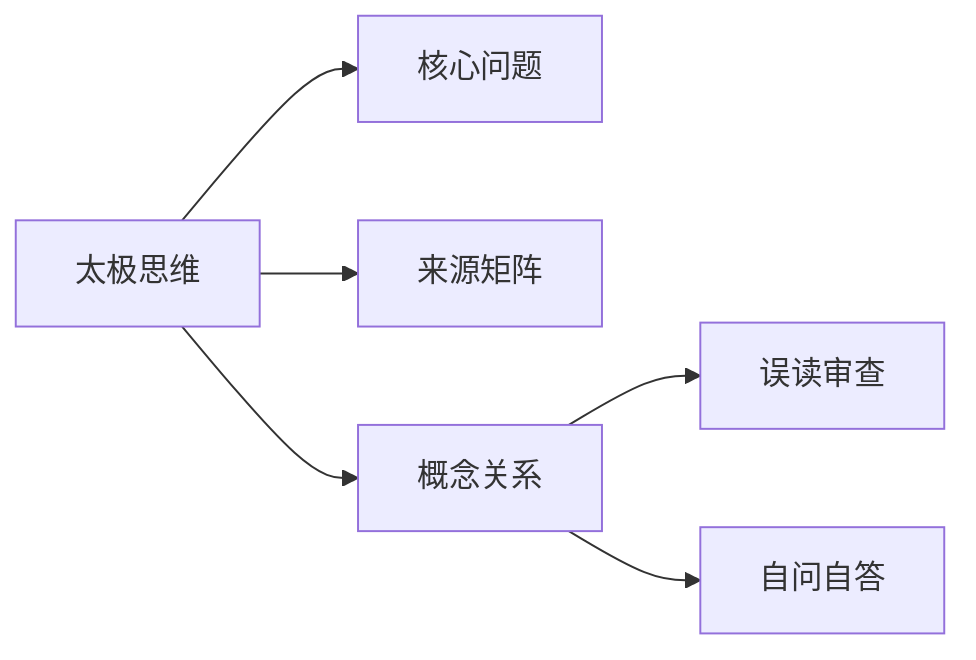

# 太极思维

## Summary

太极思维强调从线性判断退出来，进入圆转、互含和当境应理。

## Why This Matters

它是把三晳从知识变成思维方式的落点。

## Core Structure

- 先抓主题问题：太极思维强调从线性判断退出来，进入圆转、互含和当境应理。
- 再回到来源矩阵，区分主干证据和辅助证据。
- 最后用误读审查防止把概念讲死。

## Source Matrix

| 资料 | 层级 | 模块 |
| --- | --- | --- |
| [03一念落五](../sources/003-03.md) | 未分级资料 | 待归类 |
| [04五阶七无](../sources/004-04.md) | 二级基础框架资料 | 模块 B：三晳结构 |
| [06三晳互义](../sources/006-06.md) | 未分级资料 | 模块 B：三晳结构 |
| [07太极思维](../sources/007-07.md) | 未分级资料 | 待归类 |
| [14生命兼并](../sources/014-14.md) | 未分级资料 | 待归类 |
| [20同学来信](../sources/020-20.md) | 四级问答案例资料 | 模块 E：答疑与破执 |
| [20周行不殆](../sources/021-20.md) | 未分级资料 | 模块 D：理入与修证 |
| [43基础知识](../sources/045-43.md) | 二级基础框架资料 | 模块 A：入门总纲 |
| [47分享智慧](../sources/049-47.md) | 四级问答案例资料 | 模块 E：答疑与破执 |
| [33三晳讲论](../sources/034-33.md) | 一级主干资料 | 模块 F：总讲与通盘串联 |

## Key Claims

- 03一念落五：这是一条由有为渐渐地归入无为的途径
- 04五阶七无：就像上次三晳班，后面几天说话都自己提着自己的尾巴，免得给别人抓。为什么能进入这个境界呢？三晳打出来的，但这个还只是小循环，还没有到大循环。我说的这第四个，就是大循环
- 06三晳互义：标准是世见，对待是哲观
- 07太极思维：《太极经》是我们的法本
- 14生命兼并：[第16页] 16 讲，没机会了。我就是再讲生命，也不一样了，也不是这个境界 了，…… 人的知解都是界定吸收。看到和听到什么，自己先进行界定。 如果你不能理解，那你就没办法吸收。 对于那个…
- 20同学来信：超凡入圣，统归三界于一气，圆融畅达，于精神物质体证得大圆满，是，为如是

## Concept Graph

## Misreadings

- 把一个教学口径说成唯一绝对口径。
- 把概念表当成境界本身。
- 只摘句不回到整体结构。

## Self-QA Lesson

自问：这个专题先解决什么问题？

自答：先用一句白话抓住主轴，再回到来源矩阵检查证据，最后反问自己有没有把话说死。

## Related Pages

- 三晳总览

## Evidence Anchors

| 来源 | 定位 | 短摘句 |
| --- | --- | --- |
| 03一念落五 | theme_excerpt[1] | “这是一条由有为渐渐地归入无为的途径” |
| 04五阶七无 | theme_excerpt[1] | “就像上次三晳班，后面几天说话都自己提着自己的尾巴，免得给别人抓。为什么能进入这…” |
| 06三晳互义 | theme_excerpt[1] | “标准是世见，对待是哲观” |
| 07太极思维 | theme_excerpt[1] | “《太极经》是我们的法本” |
| 14生命兼并 | theme_excerpt[1] | “[第16页] 16 讲，没机会了。我就是再讲生命，也不一样了，也不是这个境界…” |
| 20同学来信 | theme_excerpt[1] | “超凡入圣，统归三界于一气，圆融畅达，于精神物质体证得大圆满，是，为如是” |
