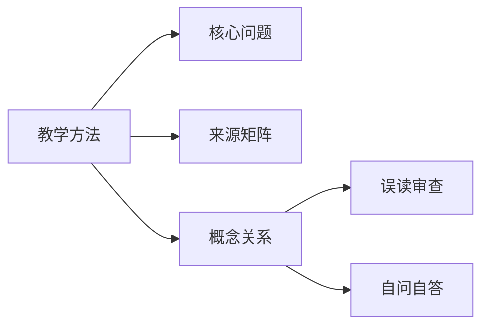

# 教学方法

## Summary

教学方法把点题、白话、体系、翻转、练习、讲评连成稳定带学结构。

## Why This Matters

它让 Wiki 不只是查询库，也能支持持续练习和讲评。

## Core Structure

- 先抓主题问题：教学方法把点题、白话、体系、翻转、练习、讲评连成稳定带学结构。
- 再回到来源矩阵，区分主干证据和辅助证据。
- 最后用误读审查防止把概念讲死。

## Source Matrix

| 资料 | 层级 | 模块 |
| --- | --- | --- |
| [32面向未来](../sources/033-32.md) | 未分级资料 | 待归类 |
| [01三晳九问](../sources/001-01.md) | 二级基础框架资料 | 模块 A：入门总纲 |
| [10太极常识](../sources/010-10.md) | 二级基础框架资料 | 模块 A：入门总纲 |
| [20同学来信](../sources/020-20.md) | 四级问答案例资料 | 模块 E：答疑与破执 |
| [21没感觉了](../sources/022-21.md) | 四级问答案例资料 | 模块 E：答疑与破执 |
| [43基础知识](../sources/045-43.md) | 二级基础框架资料 | 模块 A：入门总纲 |
| [47分享智慧](../sources/049-47.md) | 四级问答案例资料 | 模块 E：答疑与破执 |
| [50知者不问](../sources/052-50.md) | 四级问答案例资料 | 模块 E：答疑与破执 |
| [33三晳讲论](../sources/034-33.md) | 一级主干资料 | 模块 F：总讲与通盘串联 |
| [36三晳讲义](../sources/037-36.md) | 一级主干资料 | 模块 F：总讲与通盘串联 |

## Key Claims

- 32面向未来：[第1页] 中 华 炎 黄 文 化 研 究 会 太 极 文 化 专 业 委 员 会 1 面向未来，携手共创太极学传学新时代 太极文化专业委员会理事会 2019 年12 月12 日 一、太极…
- 01三晳九问：三晳格解当来，格解当来之时就是什么
- 10太极常识：心是一个，但咯噔是两种
- 20同学来信：超凡入圣，统归三界于一气，圆融畅达，于精神物质体证得大圆满，是，为如是
- 21没感觉了：这是不相信预告——我心不动
- 43基础知识：三晳无可指，是故无可执

## Concept Graph

## Misreadings

- 把一个教学口径说成唯一绝对口径。
- 把概念表当成境界本身。
- 只摘句不回到整体结构。

## Self-QA Lesson

自问：这个专题先解决什么问题？

自答：先用一句白话抓住主轴，再回到来源矩阵检查证据，最后反问自己有没有把话说死。

## Related Pages

- 三晳总览

## Evidence Anchors

| 来源 | 定位 | 短摘句 |
| --- | --- | --- |
| 32面向未来 | theme_excerpt[1] | “[第1页] 中 华 炎 黄 文 化 研 究 会 太 极 文 化 专 业 委 员…” |
| 01三晳九问 | theme_excerpt[1] | “三晳格解当来，格解当来之时就是什么” |
| 10太极常识 | theme_excerpt[1] | “心是一个，但咯噔是两种” |
| 20同学来信 | theme_excerpt[1] | “超凡入圣，统归三界于一气，圆融畅达，于精神物质体证得大圆满，是，为如是” |
| 21没感觉了 | theme_excerpt[1] | “这是不相信预告——我心不动” |
| 43基础知识 | theme_excerpt[1] | “三晳无可指，是故无可执” |
