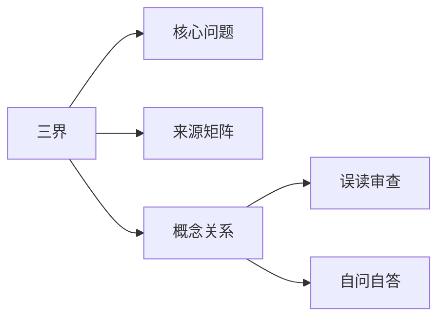

# 三界

## Summary

三界为生命、认知与境界分层提供基本框架。

## Why This Matters

三界是安放客知、本知、性知以及理入行入层次的地图。

## Core Structure

- 先抓主题问题：三界为生命、认知与境界分层提供基本框架。
- 再回到来源矩阵，区分主干证据和辅助证据。
- 最后用误读审查防止把概念讲死。

## Source Matrix

| 资料 | 层级 | 模块 |
| --- | --- | --- |
| [02一知三界](../sources/002-02.md) | 未分级资料 | 模块 C：三界与心性 |
| [16心本无象](../sources/016-16.md) | 三级专题深化资料 | 模块 C：三界与心性 |
| [36三晳讲义](../sources/038-36.md) | 一级主干资料 | 模块 F：总讲与通盘串联 |
| [20同学来信](../sources/020-20.md) | 四级问答案例资料 | 模块 E：答疑与破执 |
| [12前后三晳](../sources/012-12.md) | 二级基础框架资料 | 模块 B：三晳结构 |
| [50知者不问](../sources/052-50.md) | 四级问答案例资料 | 模块 E：答疑与破执 |
| [51物我一体](../sources/053-51.md) | 未分级资料 | 待归类 |
| [08客知本知](../sources/008-08.md) | 三级专题深化资料 | 模块 C：三界与心性 |
| [18道通三界](../sources/018-18.md) | 三级专题深化资料 | 模块 C：三界与心性 |
| [09问道证道](../sources/009-09.md) | 三级专题深化资料 | 模块 D：理入与修证 |

## Key Claims

- 02一知三界：[第1页] 1 一知与三界 生：先生以“知”为人的大欲，那知与心性神灵；知与识欲感 觉，是什么关系？它们之间是怎样协调组合的？ 师：形用有形，故有定格；神用无象，故无定式。为便有界人 见，…
- 16心本无象：自己悟，那是随时的事情
- 36三晳讲义：[第87页] 86 罪过吗？显然不能这样算。因为若是有罪，最大的祸首应该是自然。 （六根未生之前的境界能推吗？六根不用的境界有知吗？）六根之外属于知悟界定
- 20同学来信：超凡入圣，统归三界于一气，圆融畅达，于精神物质体证得大圆满，是，为如是
- 12前后三晳：三晳是宇宙最强的表达方式
- 50知者不问：其次，……还是留给大家慢慢参悟吧

## Concept Graph

## Misreadings

- 把一个教学口径说成唯一绝对口径。
- 把概念表当成境界本身。
- 只摘句不回到整体结构。

## Self-QA Lesson

自问：这个专题先解决什么问题？

自答：先用一句白话抓住主轴，再回到来源矩阵检查证据，最后反问自己有没有把话说死。

## Related Pages

- 三晳总览

## Evidence Anchors

| 来源 | 定位 | 短摘句 |
| --- | --- | --- |
| 02一知三界 | theme_excerpt[1] | “[第1页] 1 一知与三界 生：先生以“知”为人的大欲，那知与心性神灵；知与识…” |
| 16心本无象 | theme_excerpt[1] | “自己悟，那是随时的事情” |
| 36三晳讲义 | theme_excerpt[1] | “[第87页] 86 罪过吗？显然不能这样算。因为若是有罪，最大的祸首应该是自然…” |
| 20同学来信 | theme_excerpt[1] | “超凡入圣，统归三界于一气，圆融畅达，于精神物质体证得大圆满，是，为如是” |
| 12前后三晳 | theme_excerpt[1] | “三晳是宇宙最强的表达方式” |
| 50知者不问 | theme_excerpt[1] | “其次，……还是留给大家慢慢参悟吧” |
